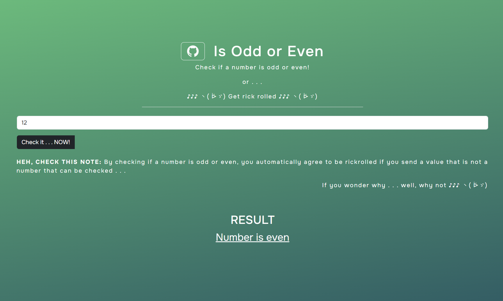

# Is Odd Or Even

This is Odd OrEven application ran by [Appwrite cloud function.](https://appwrite.io), on Appwrite platform.  
Currently working demo: [On this link](https://65196cbac2fdc66e9ea1.appwrite.global/)

## About

This project is a simple URL Shortener service.  
It contains a form with URL and Alias inputs.

In URL input you add your URL you want shorten.  
In Alias input you write something with what will you recognize what Short URL represents. It is only arbitrary. 

It contains a button that can fetch your Short URLs from a database into the table on the same page.

Here is a project preview:


### Services

This project contains services: 

- Preview of UI form and number checker
- It will rickroll you if you send invalid value 3 times in a row
---

## Project Setup

### Manual Setup

- Fork this repository
- Clone it locally
- Change project ID inisde [appwrite.json](appwrite.json) file to your project ID.
- While in root folder, run appwrite cli command `appwrite deploy function` and follow steps to deploy it
- - If you don't have appwrite cli installed, check [this link](https://appwrite.io/docs/tooling/command-line/installation) and install it on your device

## Development

This project is developed with: 
- Typescript
- appwrite-node
- HTML, CSS and JS for template

Refer to [Package JSON](package.json) file

### How to start with development

- Locally, go to `functions/is-odd-or-even` path.
- Run `npm install` command
- Start coding

**NOTE:** Make code adjustments only inside `dev` folder. Code inside `dev` folder will be built into `src` folder.

### How to deploy

- While inside `functions/is-odd-or-even` path, run `nom run build` command after you made your desired code changes
- Go back to the root folder and run `appwrite deploy function` command. Follow the steps to deploy your function. 
- If needed, refer back to [Manual Setup section](#manual-setup)

## How to use

### Routes

- GET - `/` - Shows a static generator [template](functions/is-odd-or-even/dev/ui/index.html)
- post - `/`:
- - Checks if value is a number, and if it is odd or even
- - Allows POST method only
- - Must have `'Content-Type': 'application/json'` header
- - Allowed payload example:
```
  JSON.stringify({
    number: NUMBER VALUE,
  })
```

Refer to the [template](functions/is-odd-or-even/dev/ui/index.html) to see how it is used in the simple frontend.
